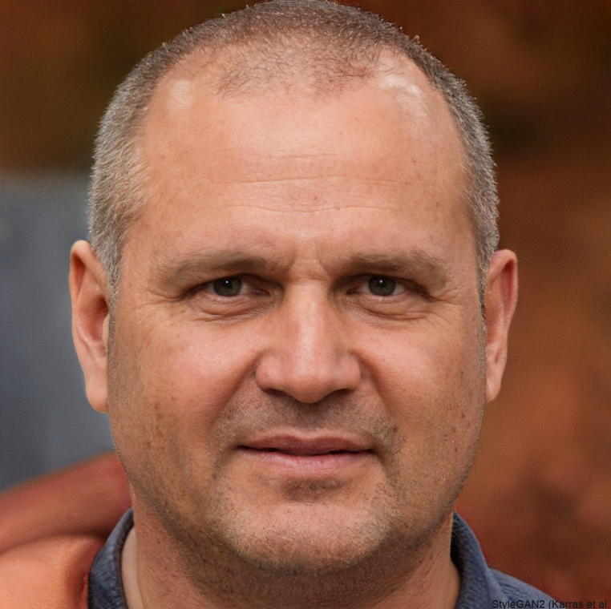
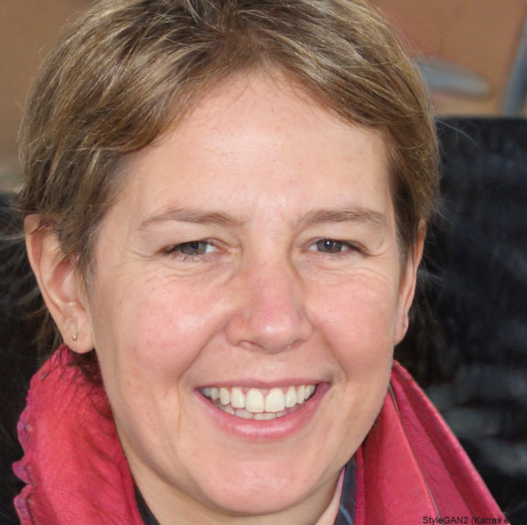
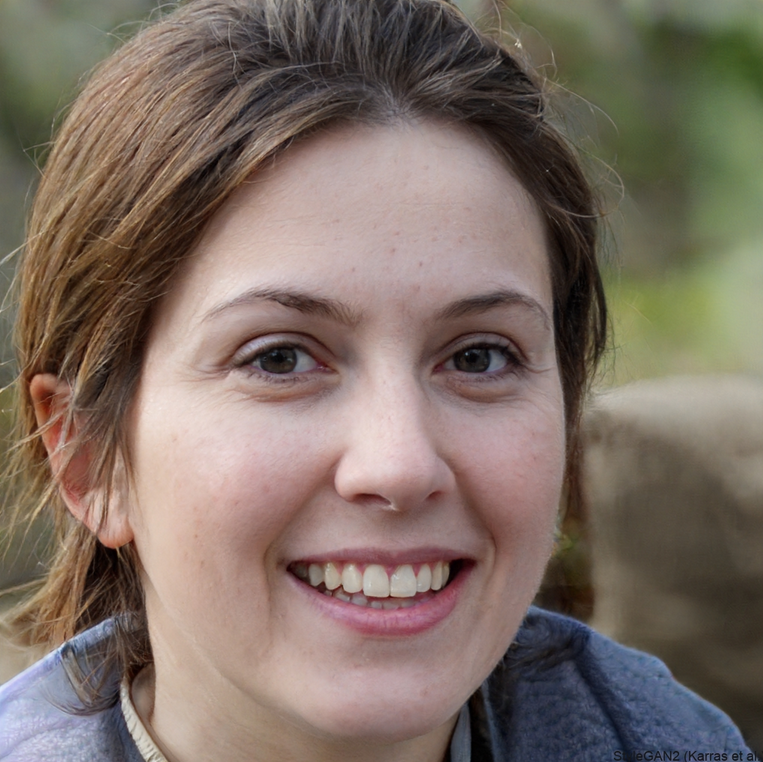

## Personas

| **Santo José de Carvalho** |           |
|----------------------------|-----------|
|  **Idade:** 56 anos. **Naturalidade:** Ribeirão Preto - SP. **Ocupação:** Engenheiro Civil. | **Descrição:** Formado em Engenharia Civil, com mestrado em Arquitetura, Santo José de Carvalho fez sua carreira em obras públicas financiadas pelo Estado de São Paulo. O constante contato com a poeira das construções o fez desenvolver diversas síndromes respiratórias.  **Demanda:** Acredita que seria muito mais fácil filtrar a bula de seus remédios através de dados pessoais.

| **Lara Navarro** |           |
|------------------|-----------|
|  **Idade:** 62 anos. **Naturalidade:** Goiânia - GO. **Ocupação:** Psicóloga. | **Descrição:** Formada em psicologia, Lara trabalha em sua clínica desde os 30 anos.  **Demanda:** Devido à sua convivência entre PCD, notou que a dificuldade de seus pacientes na leitura da bula de seus remédios desencadeou diversos casos de misturas indevidas de fármacos. 

| **Eloá Rios de Freitas** |           |
|--------------------------|-----------|
|  **Idade:** 21 anos. **Naturalidade:** Belo Horizonte - MG. **Ocupação:** Estudante de Direito. | **Descrição:** Nascida com glaucoma, teve seu quadro agravado conforme os anos. Apesar disso, estuda e sonha em exercer sua profissão.  **Demanda:** Tem dificuldade de leitura das pequenas letras, como as das bulas convencionais que vêm com os remédios.
